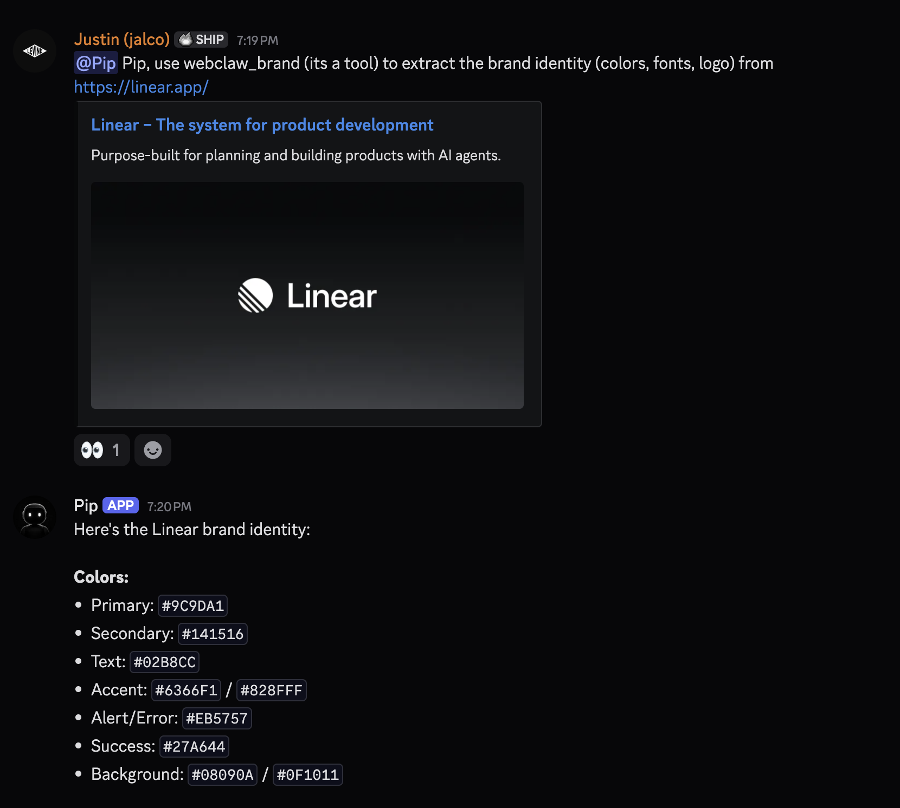

# openclaw-webclaw

OpenClaw plugin that replaces the bundled Firecrawl plugin with native [WebClaw](https://webclaw.io) v1 API support.

[](https://github.com/jal-co/openclaw-webclaw/blob/main/LICENSE)
[](https://openclaw.ai)
[](https://webclaw.io)
[](https://webclaw.io/docs)

---

## What is WebClaw?

[WebClaw](https://github.com/0xMassi/webclaw) is a fast, open-source web extraction toolkit built in Rust by [@0xMassi](https://github.com/0xMassi). It turns any website into clean markdown, JSON, plain text, or LLM-optimized output — without a headless browser. All extraction happens over raw HTTP using browser-grade TLS impersonation, making it lightweight and deployable anywhere.

WebClaw ships as a CLI, REST API, and MCP server, and is a **drop-in replacement for Firecrawl v2** with a richer native v1 API surface.

- **Source:** [github.com/0xMassi/webclaw](https://github.com/0xMassi/webclaw)
- **Docs:** [webclaw.io/docs](https://webclaw.io/docs)
- **Cloud API:** [api.webclaw.io](https://api.webclaw.io)
- **License:** AGPL-3.0

## Why this plugin?

OpenClaw ships with a bundled Firecrawl plugin that exposes two tools (`firecrawl_scrape`, `firecrawl_search`) over the Firecrawl v2 compatibility API. If you're already using a `wc_`-prefixed API key, you're hitting WebClaw's cloud through that compatibility layer — but you're only getting a fraction of what WebClaw can do.

This plugin replaces Firecrawl entirely. It registers as both the `webFetchProvider` and `webSearchProvider` so OpenClaw's built-in web tools route through WebClaw, plus exposes **9 dedicated tools** for the full v1 API surface — crawling, LLM extraction, content diffing, sitemap discovery, batch scraping, brand extraction, and more.



## Tools

| Tool | Description |
|---|---|
| `webclaw_scrape` | Single URL extraction — CSS filtering, screenshots, browser actions, mobile UA, page Q&A, 9 output formats |
| `webclaw_search` | Web search with optional parallel scraping of result URLs |
| `webclaw_crawl` | Async BFS site crawl with depth/page limits, sitemap seeding, path filtering |
| `webclaw_extract` | LLM-powered structured data extraction via JSON schema or natural language prompt |
| `webclaw_summarize` | LLM-powered page summarization |
| `webclaw_diff` | Content change tracking — compare current page against a previous JSON snapshot |
| `webclaw_map` | Sitemap discovery — find all URLs on a site via sitemap.xml and robots.txt |
| `webclaw_batch` | Multi-URL extraction in a single concurrent request |
| `webclaw_brand` | Brand identity extraction — colors, fonts, logo, favicon |

## Install

### 1. Get a WebClaw API key

Sign up at [webclaw.io](https://webclaw.io) and create an API key from the dashboard. Keys are prefixed with `wc_`.

### 2. Set the API key on the gateway host

Add `WEBCLAW_API_KEY` to your OpenClaw environment. Where you put it depends on how you run OpenClaw:

**Docker Compose** — add to your `.env` file (same directory as `docker-compose.yml`):

```bash
echo 'WEBCLAW_API_KEY=wc_your_key_here' >> .env
```

Then make sure the variable is passed through in `docker-compose.yml`:

```yaml
services:
  openclaw-gateway:
    environment:
      - WEBCLAW_API_KEY
```

**Systemd / bare metal** — add to your OpenClaw env file:

```bash
echo 'WEBCLAW_API_KEY=wc_your_key_here' >> ~/.openclaw/.env
```

**Manual export** (for testing):

```bash
export WEBCLAW_API_KEY="wc_your_key_here"
```

### 3. Install the plugin

From inside the OpenClaw gateway container (or wherever `openclaw` CLI runs):

```bash
openclaw plugins install /path/to/openclaw-webclaw
```

Or if published to npm:

```bash
openclaw plugins install npm:@jalco/openclaw-webclaw
```

### 4. Disable the bundled Firecrawl plugin

Both plugins register web fetch and web search providers, so running them simultaneously causes conflicts. Disable Firecrawl via **one** of these methods:

**CLI:**

```bash
openclaw plugins disable firecrawl
```

**Config patch:**

```bash
openclaw config patch --json5 '{ plugins: { entries: { firecrawl: { enabled: false } } } }'
```

**Dashboard:** Plugins → Firecrawl → toggle off.

> **Note:** There is no automatic "replaces" mechanism in the OpenClaw plugin system. Firecrawl must be disabled manually.

### 5. Restart the gateway

```bash
# Docker Compose
docker compose restart openclaw-gateway

# Systemd
sudo systemctl restart openclaw-gateway

# Or just restart from CLI
openclaw gateway restart
```

### 6. Verify

```bash
openclaw plugins inspect webclaw
```

You should see `Status: loaded` and `web-search: webclaw` under Capabilities.

## Dashboard Settings

After installing, the WebClaw plugin appears in the dashboard under **Plugins → WebClaw** with these settings:

| Setting | Description |
|---|---|
| **WebClaw API Key** | Your `wc_` API key (or set via `WEBCLAW_API_KEY` env var) |
| **Extract Main Content Only** | Skip nav/sidebar/footer by default |
| **Base URL** _(advanced)_ | Override for self-hosted instances |
| **Request Timeout** _(advanced)_ | Default timeout in seconds |
| **Cache TTL** _(advanced)_ | Local cache duration in milliseconds |

You can also set the API key directly in the dashboard instead of using an environment variable.

## Optional Config

```json5
{
  plugins: {
    entries: {
      webclaw: {
        config: {
          // API key (alternative to env var — set via dashboard or config)
          apiKey: { source: "env", provider: "default", id: "WEBCLAW_API_KEY" },
          // Base URL override (default: https://api.webclaw.io)
          baseUrl: "https://api.webclaw.io",
          // Default timeout for all requests (default: 30s)
          timeoutSeconds: 30,
          // Extract only main content by default (default: true)
          onlyMainContent: true,
          // Cache TTL in milliseconds (default: 48h)
          maxAgeMs: 172800000,
        },
      },
    },
  },
}
```

## Migrating from Firecrawl

If you're already using `FIRECRAWL_API_KEY` with a `wc_`-prefixed key, you're hitting WebClaw's cloud API via the Firecrawl v2 compatibility layer. This plugin switches to the native v1 endpoints for the full feature set.

1. Set `WEBCLAW_API_KEY` to your existing `wc_` key
2. Install the plugin and disable Firecrawl (see above)
3. Restart the gateway

Your existing `web_fetch` and `web_search` calls will now route through WebClaw, plus you get 7 new tools (`webclaw_crawl`, `webclaw_extract`, `webclaw_summarize`, `webclaw_diff`, `webclaw_map`, `webclaw_batch`, `webclaw_brand`).

## Environment Variables

| Variable | Required | Description |
|---|---|---|
| `WEBCLAW_API_KEY` | Yes | Your WebClaw API key (`wc_...`). Get one at [webclaw.io](https://webclaw.io). |
| `WEBCLAW_BASE_URL` | No | Override the API base URL. Default: `https://api.webclaw.io`. Use for self-hosted instances. |

The plugin resolves credentials in this order:

1. `plugins.entries.webclaw.config.apiKey` in OpenClaw config (set via dashboard or config file)
2. `WEBCLAW_API_KEY` environment variable

For Docker Compose deployments, add the variable to your `.env` file and pass it through in `docker-compose.yml`:

```yaml
services:
  openclaw-gateway:
    env_file: .env
    environment:
      - WEBCLAW_API_KEY
```

For systemd or bare-metal installs, add it to `~/.openclaw/.env` or export it in the gateway service environment.

## Self-Hosting WebClaw

If you're running [`webclaw-server`](https://github.com/0xMassi/webclaw) on your own infrastructure instead of using the cloud API:

```bash
# Start the server
webclaw-server --port 3000 --api-key your_secret
```

Then set the base URL in OpenClaw config:

```json5
{
  plugins: {
    entries: {
      webclaw: {
        config: {
          baseUrl: "http://your-server:3000",
          apiKey: "your_secret",
        },
      },
    },
  },
}
```

Or via environment variables:

```bash
WEBCLAW_API_KEY=your_secret
WEBCLAW_BASE_URL=http://your-server:3000
```

See the [WebClaw self-hosting docs](https://webclaw.io/docs/self-hosting) for full setup instructions.

## Development

```bash
git clone https://github.com/jal-co/openclaw-webclaw
cd openclaw-webclaw
npm install
npm run build
```

> **Note:** The `openclaw` peer dependency resolves from the OpenClaw runtime, not public npm. The plugin compiles and runs correctly when installed into an OpenClaw gateway. To type-check locally, link against a local OpenClaw monorepo checkout.

## Credits

This plugin is powered by [WebClaw](https://github.com/0xMassi/webclaw) by [@0xMassi](https://github.com/0xMassi) — a fast, Rust-based web extraction toolkit for LLMs. WebClaw provides the extraction engine, cloud API, and Firecrawl v2 compatibility layer that this plugin builds on.

## License

[AGPL-3.0](./LICENSE) — same license as WebClaw.
